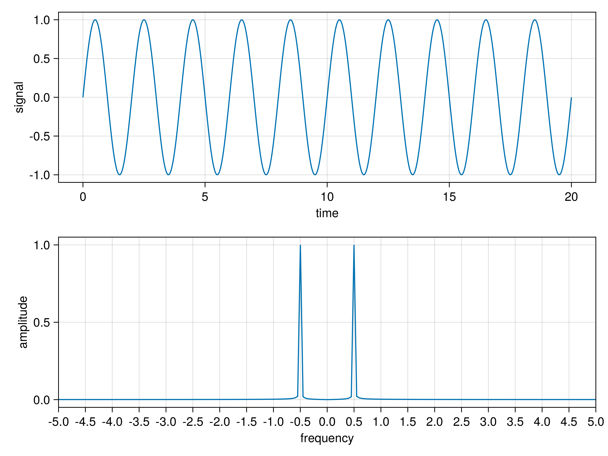

# Fast-Fourier Transform (FFT) Module

This module provides a fast-Fourier transform (FFT) module for efficient FFT computations on time-domain and frequency-domain signal sequences. Currently, the module supports radix-2 FFT and arbitrary sequence sizes with a specific `T<:AbstractFloat` type. Soon, it will offer more efficient real-to-complex FFT than complex-to-complex FFT for both radix-2 and arbitrary sequence sizes.

## # Install and Import Module

To use this module, you can import the module by running the following command in the `Julia` REPL:

```julia
using Pkg
Pkg.activate() # <-- Add this line if you use Pluto.jl
Pkg.add(url="https://github.com/FemtoPhysics/SpectroDSP.jl.git")

import SpectroDSP: FFT
```

## # Usage

### ## Prepare FFT Kernel

#### Prepare Radix-2 Kernel

For example, if you have a signal sequence `signal` of size `32`.

To initialize and obtain a kernel for radix-2 FFT, you can use the following constructor:

```julia
fftkernel = FFT.Radix2FFT{eltype(signal)}(length(signal))
```

Or the default constructor with `Float64` type:

```julia
fftkernel = FFT.Radix2FFT(length(signal))
```

#### Prepare Non-Radix-2 Kernel

For example, if you have a signal sequence `signal` of size `28`.

To initialize and obtain a kernel for radix-2 FFT, you can use the following constructor:

```julia
fftkernel = FFT.NonRadix2FFT{eltype(signal)}(length(signal))
```

Or the default constructor with `Float64` type:

```julia
fftkernel = FFT.NonRadix2FFT(length(signal))
```

### ## In-place and Copy-based FFT

```julia
# In-place FFT
spectrum = similar(signal, Complex{eltype(signal)})
FFT.fft!(spectrum, fftkernel)

# or

# Copy-based FFT
spectrum = FFT.fft(signal, fftkernel)
```

### ## In-place and Copy-based Inverse FFT (IFFT)

```julia
# In-place IFFT
recovered_signal = similar(spectrum, Complex{eltype(signal)})
FFT.ifft!(recovered_signal, fftkernel)

# or

# Copy-based IFFT
recovered_signal = FFT.ifft(spectrum, fftkernel)
```

### ## Obtain FFT Frequencies

```julia
freq = FFT.fftfreq(length(signal), Δt) # Δt is the timestep
```

### ## Obtain FFT Amplitude Spectrum

```julia
ampl = FFT.fftampl!(similar(signal), spectrum)
```

## # Usage

```julia
import CairoMakie as cm

function demo(; sz::Int=501)
    tarr = collect( range(0.0, 20.0; length=sz) ) # time series
    yarr = similar(tarr, Float64)                 # time-domain signal
    spec = similar(tarr, ComplexF64)              # signal spectrum
    ampl = similar(tarr, Float64)                 # spectral amplitudes
    freq = FFT.fftfreq(sz, tarr[2] - tarr[1])     # frequency sereies

    # simulate a sine signal with frequency f = 0.5
    for i in eachindex(yarr)
        yarr[i] = sinpi(tarr[i])
    end

    # fft size is NOT a number of 2 to an integer power
    fftk = FFT.NonRadix2FFT{eltype(yarr)}(sz)

    # Convert the signal to the complex space
    copyto!(spec, yarr)

    # Compute FFT using the pre-defined kernel
    # The kernel can be reused to transform other signals
    FFT.fft!(spec, fftk)

    FFT.fftshift!(freq)
    FFT.fftshift!(spec)
    FFT.fftampl!(ampl, spec)

    # = = = = = = = = = = = #
    # Visualize the result  #
    # = = = = = = = = = = = #

    fig = cm.Figure()
    ax1 = cm.Axis(fig[1,1]; xlabel="time", ylabel="signal")
    cm.lines!(ax1, tarr, yarr)

    ax2 = cm.Axis(fig[2,1]; xlabel="frequency", ylabel="amplitude",
                  limits=(-5, 5, nothing, nothing), xticks=-5.0:0.5:5.0)
    cm.lines!(ax2, freq, ampl)

    return fig
end
```

The above code returns a figure as:



## # Future Features

Soon, this module will provide additional functionality:

1. Complex-to-complex FFT with arbitrary sequence sizes.
2. More efficient real-to-complex FFT (compared to complex-to-complex FFT) for both radix-2 and arbitrary sequence sizes.

### TODO

- [x] C2C-FFT for radix-2 sizes
- [ ] R2C-FFT for radix-2 sizes
- [x] C2C-FFT for arbitrary sizes
- [ ] R2C-FFT for arbitrary sizes
- [x] C2C-IFFT for radix-2 sizes
- [ ] C2C-IFFT for arbitrary sizes
- [x] FFT Frequency
- [x] FFT Amplitude

Stay tuned for updates and new releases!